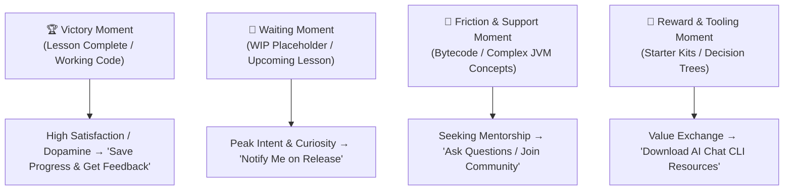

# Funnel Placement & Student Conversion Strategy

This document defines the strategic conversion touchpoints, psychological triggers, and placement matrix for forms and community onboarding across the `kotlin-0-dev` documentation platform.

---

## 1. Executive Summary & Psychological Framework

In developer education and technical documentation platforms, conversion rates (form fills, email captures, community sign-ups) peak when aligned with specific **emotional moments in the student journey**:

---

## 2. Emotional Trigger Analysis

### 2.1 The "Victory Moment" (End of Completed Lessons)
- **Trigger:** The student successfully compiles their Kotlin code, sees the terminal output, or completes an incremental lab step.
- **Conversion Rate:** Moderate to High (~15–25%).
- **Intent:** Solidify knowledge, receive feedback on their code, or share achievements.
- **Recommended CTA:**
  > *"Completed today's lab? Register to receive annotated code solutions and the next lesson challenge."*

### 2.2 The "Waiting Moment" (Work-In-Progress / Upcoming Lessons)
- **Trigger:** The student reads through available content (e.g., L1, L2), desires to continue, and encounters a WIP placeholder (L3–L16).
- **Conversion Rate:** Extremely High (~30–50%).
- **Intent:** High-intent students who want immediate access as soon as the lesson is drafted.
- **Recommended CTA:**
  > *"This lesson is currently being drafted. Leave your email to be the first to receive the release alert and starter templates."*

### 2.3 The "Friction & Support Moment" (Deep Theory / Platform Nuances)
- **Trigger:** Difficult architectural sections (e.g., JVM Bytecode, Platform Types, Coroutines Dispatchers, Memory leaks).
- **Conversion Rate:** High for active learners (~20–30%).
- **Intent:** Get help, ask clarifying questions, or report setup bugs (JDK/Gradle).
- **Recommended CTA:**
  > *"Encountered issues configuring your JDK or running Gradle? Submit your question or join our community support."*

### 2.4 The "Reward & Lead Magnet Moment" (Curated Assets)
- **Trigger:** Reusable resources that save developer time.
- **Conversion Rate:** High (~25–40%).
- **Key Developer Lead Magnets:**
  1. **AI Chat CLI Repository Starter Kit:** Access to git branches with lesson-by-lesson commits (`L1-done`, `L2-done`).
  2. **Kotlin Architecture Cheat Sheets:**
     - *Scope Functions Decision Tree (`let`, `run`, `with`, `apply`, `also`)*.
     - *Null Safety & Platform Types Reference Card*.
  3. **Official Certificate of Completion:** Verified credential awarded upon meeting criteria:
     - Full course coverage (16 lessons × $600 MXN = $9,600 MXN).
     - 100% incremental lab completion in student's GitHub repository.
     - Passing a live 1-on-1 technical code defense session explaining architecture and implementation.
     - Fast-track certification available for self-paced students completing all requirements ahead of schedule.

---

## 3. Strategic Placement Matrix

| Placement Location | Funnel Stage | Objective | Component / Format |
| :--- | :--- | :--- | :--- |
| **Course Welcome Funnel (`00-kotlin-for-begginers.mdx`)** | Top (TOFU) | Early onboarding of students following the 16-lesson roadmap. | `<CardGrid>` with CTA to Tally community form. |
| **Global Portal Landing (`index.mdx`)** | Top (TOFU) | Ecosystem-wide newsletter and community registration. | Dedicated section *"Comunidad y Novedades"* with `<LinkCard>`. |
| **WIP Lesson Placeholders (`03` to `16`)** | Mid (MOFU) | Capture high-intent traffic reaching unreleased lessons. | `<Aside type="caution">` with *"Notify me when published"* link. |
| **Lesson Footers (`01-environment...`, `02-variables...`)** | Mid (MOFU) | Pedagogical feedback loop and friction detection. | Section *"Feedback y Dudas de la Lección"*. |
| **Module Completion Checkpoints (L4, L8, L12, L16)** | Mid/Bottom (MOFU/BOFU) | Assessment, quiz scoring, and milestone badges. | Interactive Tally Quiz widget. |
| **Final Project Submission (L16)** | Bottom (BOFU) | Project submission (GitHub repo URL) & certification. | Final Project Delivery & Feedback Form. |

---

## 4. Technical Implementation & Form Integration

All forms are created and synchronized using **Tally MCP**:

- **General Form Architecture:** [FORMS_DESIGN.md](./FORMS_DESIGN.md)
- **Course 2 Funnel Form Spec:** [course_2_funnel_form.md](./forms/course_2_funnel_form.md)
- **Production Form URL:** `https://tally.so/r/GxAj5o` (Form ID: `GxAj5o`, Workspace: `wgbE9P`)

---

## 5. Next Optimization Steps

1. **Add Direct "Notify Me" CTAs in WIP Lessons:** Embed targeted links to `https://tally.so/r/GxAj5o` inside all 14 placeholder lessons (`03`–`16`).
2. **Build Interactive Module Quizzes:** Design end-of-module knowledge check forms with instant scoring via Tally.
3. **Automate Email Notifications:** Connect Tally webhooks to automate starter template delivery when students register.
